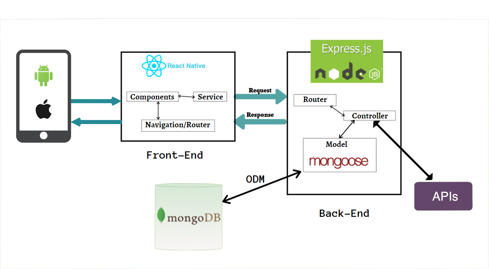

# Liiku-ulkona-api
REST API for [Liiku-ulkona-app](https://github.com/utsabk/liiku-ulkona-app) that provides sports-places for Helsinki city specifically. The data is orginally fetched and saved from open data of Finnish sports-places [Lipas](http://lipas.cc.jyu.fi/api/index.html). Lipas is a nationwide, public GIS service for Finnish sport sites.

## App Flow 
<p align="center">
    <a href="http://">
        
    </a>
</p>

## ✔️ Requirements

Node (versions `14.X.X` are tested, but later versions _might_ work as well) and npm. If you haven't installed Node or npm, [nvm](https://github.com/nvm-sh/nvm) is an easy to use tool for installing both. Nvm is also handy if you want to quickly switch between different Node versions.

# Getting started

### Clone

To get the Node server running locally.

```sh
git clone git@github.com:utsabk/liiku-ulkona-api.git
cd liiku-ulkona-api
```

### Set up the local environment
Create a file `.env` in the `liiku-ulkona-api` directory and copy the contents of the `.env.template` file there. In the `.env` file, replace `DB_URL` variable values with your MongoDB URL. If you want, you can also use a different secret for the `JWT_SECRET` variable, which is used to sign access tokens.

All done! Just run following commands on project path

```sh
$ npm install
$ npm start
```
Your app should now be running on [localhost:8000](http://localhost:8000/)


## Endpoints
### GET /activities
Returns a list of sport places. Example:
```
[
  {
        "type": {
            "name": "Boating services",
            "typeCode": 203
        },
        "location": {
            "coordinates": {
                "lon": 24.9007445076357,
                "lat": 60.1861647846836
            },
            "address": "Seurasaarentie 2a"
        },
        "_id": "61879fc3daba1e5d9b24df5b",
        "sportsPlaceId": 72985,
        "name": "Seurasaarentien venesatama (Meilahden veneilijät Ry)",
        "__v": 0
    }
]
```
#### GET /activities?code=<*value-here*>
Returns a list of all matching activities with the given type code. Example response with value **4440**.
```
[
    {
        "type": {
            "name": "Dog skijoring track",
            "typeCode": 4440
        },
        "location": {
            "coordinates": {
                "lon": 24.9494484499631,
                "lat": 60.2671849649563
            },
            "address": "Kuusimiehentie"
        },
        "_id": "61879fc3daba1e5d9b24e86c",
        "sportsPlaceId": 527177,
        "name": "Paloheinän vetokoiralatu",
        "__v": 0
    }
]
```

### GET /activity/types
Returns a list of all sport places types. Example:
```
[
  {
        "_id": "618642dd5a02f589c1d04ca5",
        "typeCode": 4210,
        "name": "Curling sheet"
    }
]
```
#### GET /activity/types?name=<*value-here*>
Returns a list of all matching activity types with the given name. Example response with value **swimming pool**.
```
[
    {
        "_id": "618642dd5a02f589c1d04cfb",
        "typeCode": 3120,
        "name": "Swimming pool"
    },
    {
        "_id": "618642dd5a02f589c1d04d22",
        "typeCode": 3110,
        "name": "Public indoor swimming pool"
    }
]
```

### POST /auth/
Authentication route

#### POST /auth/login
Endpoint to Sign In with email & password.
#### POST /auth/register
Endpoint to Register new user account.


### GET /users/
Returns list of all registered users. Example:

```
[
    {
        "_id": "61ae8363b23121383c1a0e51",
        "username": "test user",
        "points": 36
    }
]
```

### GET /users/<***user-id***>
Returns a single user.

